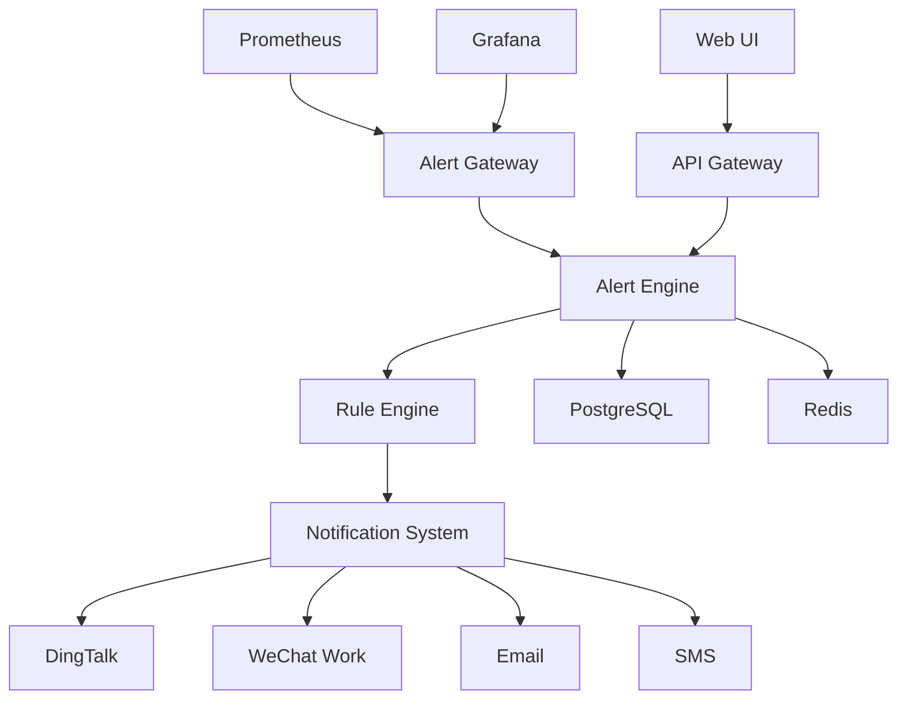

# AlertBot 技术规格说明

## 1. 系统概述

AlertBot 是一个高性能的告警管理平台，采用微服务架构设计，支持海量告警处理和多样化通知渠道。

### 1.1 核心特性
- 🚀 高并发告警处理 (10000+ QPS)
- 🎯 智能告警去重和聚合
- 🔄 实时告警状态同步
- 📊 可视化规则配置
- 🌐 多种通知渠道支持

### 1.2 兼容性
- ✅ 完全兼容 Prometheus Alertmanager Webhook 格式
- ✅ 支持 Grafana 告警集成
- ✅ 兼容 OpenMetrics 标准

## 2. 系统架构

### 2.1 整体架构



### 2.2 核心模块

#### 2.2.1 Alert Gateway (告警网关)
- **职责**: 接收外部告警，验证格式，预处理
- **技术**: Go + Gin, 支持中间件扩展
- **性能**: 单实例支持 5000+ QPS

#### 2.2.2 Alert Engine (告警引擎)  
- **职责**: 告警处理、状态管理、持久化
- **技术**: Go 协程池 + Channel 通信
- **特性**: 无锁设计，支持水平扩展

#### 2.2.3 Rule Engine (规则引擎)
- **职责**: 规则匹配、路由决策、告警聚合
- **算法**: 基于 Trie 树的高效匹配
- **扩展**: 支持自定义规则插件

#### 2.2.4 Notification System (通知系统)
- **职责**: 多渠道消息发送、失败重试
- **模式**: 异步队列 + 限流控制
- **可靠性**: 指数退避重试策略

## 3. 数据库设计

### 3.1 数据库选型
- **主库**: PostgreSQL 14+ (支持 JSONB 和全文搜索)
- **缓存**: Redis 7+ (支持 Stream 和 Pub/Sub)
- **时序**: 可选 InfluxDB (告警指标存储)

### 3.2 核心表结构

```sql
-- 告警实例表
CREATE TABLE alerts (
    id BIGSERIAL PRIMARY KEY,
    fingerprint VARCHAR(64) UNIQUE NOT NULL,
    labels JSONB NOT NULL,
    annotations JSONB DEFAULT '{}',
    status VARCHAR(20) DEFAULT 'firing',
    severity VARCHAR(20) DEFAULT 'warning',
    starts_at TIMESTAMP WITH TIME ZONE NOT NULL,
    ends_at TIMESTAMP WITH TIME ZONE,
    updated_at TIMESTAMP WITH TIME ZONE DEFAULT NOW(),
    created_at TIMESTAMP WITH TIME ZONE DEFAULT NOW()
);

-- 路由规则表
CREATE TABLE routing_rules (
    id SERIAL PRIMARY KEY,
    name VARCHAR(255) NOT NULL,
    description TEXT,
    conditions JSONB NOT NULL,
    receivers JSONB NOT NULL,
    priority INTEGER DEFAULT 0,
    enabled BOOLEAN DEFAULT true,
    created_at TIMESTAMP WITH TIME ZONE DEFAULT NOW(),
    updated_at TIMESTAMP WITH TIME ZONE DEFAULT NOW()
);

-- 通知渠道表
CREATE TABLE notification_channels (
    id SERIAL PRIMARY KEY,
    name VARCHAR(255) NOT NULL,
    type VARCHAR(50) NOT NULL,
    config JSONB NOT NULL,
    enabled BOOLEAN DEFAULT true,
    created_at TIMESTAMP WITH TIME ZONE DEFAULT NOW(),
    updated_at TIMESTAMP WITH TIME ZONE DEFAULT NOW()
);

-- 静默规则表
CREATE TABLE silences (
    id SERIAL PRIMARY KEY,
    matchers JSONB NOT NULL,
    starts_at TIMESTAMP WITH TIME ZONE NOT NULL,
    ends_at TIMESTAMP WITH TIME ZONE NOT NULL,
    creator VARCHAR(255) NOT NULL,
    comment TEXT,
    created_at TIMESTAMP WITH TIME ZONE DEFAULT NOW()
);

-- 告警历史表
CREATE TABLE alert_history (
    id BIGSERIAL PRIMARY KEY,
    alert_fingerprint VARCHAR(64) NOT NULL,
    action VARCHAR(50) NOT NULL,
    details JSONB DEFAULT '{}',
    created_at TIMESTAMP WITH TIME ZONE DEFAULT NOW()
);
```

### 3.3 索引策略

```sql
-- 高频查询索引
CREATE INDEX idx_alerts_status ON alerts(status);
CREATE INDEX idx_alerts_severity ON alerts(severity);
CREATE INDEX idx_alerts_created_at ON alerts(created_at);
CREATE INDEX idx_alerts_labels_gin ON alerts USING GIN(labels);

-- 复合索引
CREATE INDEX idx_alerts_status_created ON alerts(status, created_at DESC);
CREATE INDEX idx_routing_rules_priority ON routing_rules(priority DESC, enabled);
```

## 4. API 设计

### 4.1 RESTful API 规范

#### 4.1.1 告警管理

```http
# 接收告警 (兼容 Prometheus 格式)
POST /api/v1/alerts
Content-Type: application/json

[
  {
    "labels": {
      "alertname": "HighCPUUsage",
      "instance": "server1:9100",
      "severity": "warning"
    },
    "annotations": {
      "description": "CPU usage is above 80%",
      "summary": "High CPU usage detected"
    },
    "startsAt": "2025-08-05T10:30:00Z",
    "endsAt": "0001-01-01T00:00:00Z"
  }
]

# 查询告警
GET /api/v1/alerts?status=firing&severity=critical&page=1&size=20

# 告警操作
PUT /api/v1/alerts/{fingerprint}/silence
PUT /api/v1/alerts/{fingerprint}/ack
DELETE /api/v1/alerts/{fingerprint}
```

#### 4.1.2 规则管理

```http
# 规则 CRUD
GET /api/v1/rules
POST /api/v1/rules
PUT /api/v1/rules/{id}
DELETE /api/v1/rules/{id}

# 规则测试
POST /api/v1/rules/test
{
  "conditions": {...},
  "sample_alert": {...}
}
```

#### 4.1.3 通知渠道

```http
# 渠道管理
GET /api/v1/channels
POST /api/v1/channels
PUT /api/v1/channels/{id}

# 渠道测试
POST /api/v1/channels/{id}/test
{
  "message": "Test notification"
}
```

### 4.2 WebSocket 实时接口

```javascript
// 实时告警推送
const ws = new WebSocket('ws://localhost:8080/api/v1/ws/alerts');

ws.onmessage = function(event) {
  const alert = JSON.parse(event.data);
  console.log('New alert:', alert);
};
```

### 4.3 错误处理

```json
{
  "error": {
    "code": "INVALID_REQUEST",
    "message": "Invalid alert format",
    "details": {
      "field": "labels.alertname",
      "reason": "required field missing"
    }
  }
}
```

## 5. 前端技术规范

### 5.1 技术栈

```json
{
  "framework": "React 18",
  "language": "TypeScript 5.0",
  "ui": "Ant Design 5.x",
  "state": "Zustand + React Query",
  "routing": "React Router 6",
  "charts": "Recharts",
  "bundler": "Vite",
  "testing": "Vitest + React Testing Library"
}
```

### 5.2 项目结构

```
src/
├── components/          # 通用组件
│   ├── Alert/          # 告警相关组件
│   ├── Chart/          # 图表组件
│   └── Form/           # 表单组件
├── pages/              # 页面组件
│   ├── Dashboard/      # 仪表板
│   ├── Alerts/         # 告警管理
│   ├── Rules/          # 规则管理
│   └── Settings/       # 系统设置
├── hooks/              # 自定义 Hooks
├── services/           # API 服务
├── stores/             # 状态管理
├── types/              # TypeScript 类型
└── utils/              # 工具函数
```

### 5.3 组件规范

```typescript
// 组件类型定义
interface AlertListProps {
  filters: AlertFilters;
  onAlertSelect: (alert: Alert) => void;
  loading?: boolean;
}

// 组件实现
const AlertList: React.FC<AlertListProps> = ({ 
  filters, 
  onAlertSelect, 
  loading = false 
}) => {
  const { data, isLoading } = useAlerts(filters);
  
  return (
    <Table
      dataSource={data}
      loading={loading || isLoading}
      onRow={(record) => ({
        onClick: () => onAlertSelect(record),
      })}
    />
  );
};
```

## 6. 性能指标

### 6.1 后端性能
- **告警接收**: 10000+ QPS
- **查询响应**: P95 < 100ms, P99 < 500ms  
- **内存使用**: < 512MB (单实例)
- **CPU 使用**: < 2 Core (正常负载)

### 6.2 前端性能
- **首屏加载**: < 2s (3G 网络)
- **页面切换**: < 500ms
- **bundle 大小**: < 1MB (gzipped)
- **内存占用**: < 100MB

### 6.3 数据库性能
- **连接池**: 20 个连接
- **查询缓存**: 命中率 > 90%
- **索引效率**: 查询时间 < 10ms

## 7. 安全规范

### 7.1 认证授权
```go
// JWT Token 认证
type Claims struct {
    UserID   uint   `json:"user_id"`
    Username string `json:"username"`
    Role     string `json:"role"`
    jwt.StandardClaims
}

// RBAC 权限控制
type Permission struct {
    Resource string `json:"resource"`
    Action   string `json:"action"`
}
```

### 7.2 数据安全
- **敏感数据加密**: AES-256-GCM
- **API 限流**: 100 req/min/IP
- **输入验证**: 所有用户输入严格校验
- **SQL 注入防护**: 使用参数化查询

### 7.3 通信安全
- **HTTPS 强制**: 生产环境必须使用 TLS 1.3
- **CORS 配置**: 严格的跨域策略
- **CSP 头**: 内容安全策略防护

## 8. 监控和日志

### 8.1 指标监控
```go
// Prometheus 指标
var (
    alertsReceived = promauto.NewCounterVec(
        prometheus.CounterOpts{
            Name: "alertbot_alerts_received_total",
            Help: "Total number of alerts received",
        },
        []string{"status", "severity"},
    )
    
    alertProcessingDuration = promauto.NewHistogramVec(
        prometheus.HistogramOpts{
            Name: "alertbot_alert_processing_duration_seconds",
            Help: "Time spent processing alerts",
        },
        []string{"operation"},
    )
)
```

### 8.2 结构化日志
```go
log.WithFields(logrus.Fields{
    "alert_id": alert.ID,
    "fingerprint": alert.Fingerprint,
    "severity": alert.Severity,
    "duration": processingTime,
}).Info("Alert processed successfully")
```

## 9. 部署规范

### 9.1 Docker 配置
```dockerfile
FROM golang:1.21-alpine AS builder
WORKDIR /app
COPY . .
RUN go mod download
RUN CGO_ENABLED=0 GOOS=linux go build -o alertbot

FROM alpine:3.18
RUN apk --no-cache add ca-certificates tzdata
WORKDIR /root/
COPY --from=builder /app/alertbot .
EXPOSE 8080
CMD ["./alertbot"]
```

### 9.2 Kubernetes 部署
```yaml
apiVersion: apps/v1
kind: Deployment
metadata:
  name: alertbot
spec:
  replicas: 3
  selector:
    matchLabels:
      app: alertbot
  template:
    metadata:
      labels:
        app: alertbot
    spec:
      containers:
      - name: alertbot
        image: alertbot:latest
        ports:
        - containerPort: 8080
        env:
        - name: DB_HOST
          value: "postgresql"
        - name: REDIS_HOST
          value: "redis"
        resources:
          requests:
            memory: "256Mi"
            cpu: "500m"
          limits:
            memory: "512Mi"
            cpu: "1000m"
```

---

**文档版本**: v1.0  
**最后更新**: 2025-08-05  
**审核状态**: 待审核